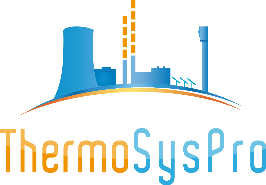

ThermoSysPro is a library providing model components for thermal hydraulics, instrumentation and control. It has been developed in the Modelica language from the Modelica Association .

The library is released under the open source [Modelica License 2](https://www.modelica.org/licenses/ModelicaLicense2) and can be used for teaching, academic and industrial purposes.

ThermoSysPro has been mainly designed for the modeling and simulation of thermal power plants of all kinds (nuclear, fossil fuel fired, solar, biomass, combined heat and power…), but can also be used for energy systems at large such as heat networks or industrial processes.

The library documentation is available at [https://thermosyspro.gitlab.io/documentation](https://thermosyspro.gitlab.io/documentation).
More information can be found on [ThermoSysPro website](https://thermosyspro.com). 