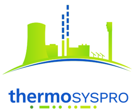

*Warning*: the **thermosyspro** official repository has been moved: [official repository](https://gitlab.pam-retd.fr/thermosysproandco/ThermoSysPro).

You will find there the last releases of the code and you will have a better view of ongoing developments and of our roadmap for the future. We strongly recommend you to join us on the official repository for any interaction (see our [contribution guidelines](https://gitlab.pam-retd.fr/thermosysproandco/ThermoSysPro/-/blob/master/ContributionsWorkflow.md?ref_type=heads))... but we keep this repository on GitHub to ease reporting for external contributors, if needed. ;)

 

[ThermoSysPro](https://thermosyspro.com) is an open-source library providing model components for thermal hydraulics, instrumentation and control. It has been developed in the Modelica language from the [Modelica Association](https://www.modelica.org).